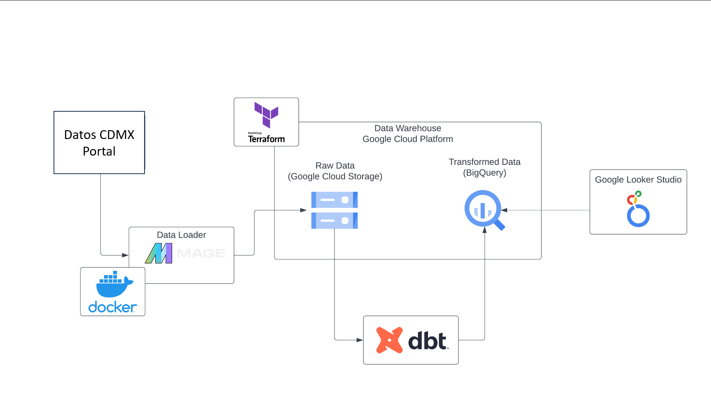
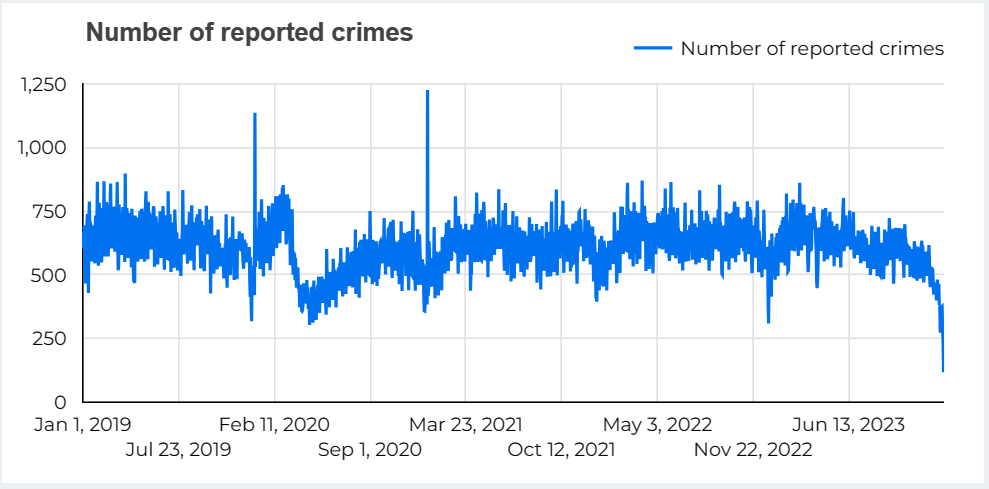
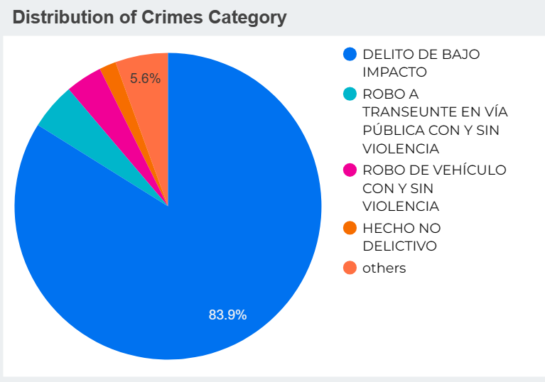
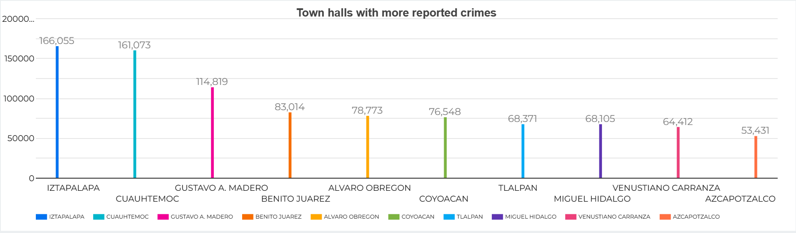
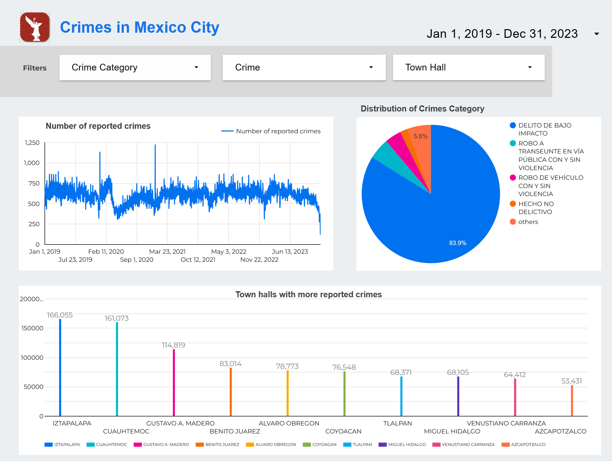

# Crime in Mexico City - Data Engineering Project

Hi everyone, this is my final project for #dezoomcamp. I've reviewed the list of datasets and other projects for inspiration, and I've decided to use the datasets provided for the goverment of my country. Since I live in Mexico city, I had doubts about whether there is a registry of crimes (delitos) here. And voilà! I discovered the dataset from the FGJ institution

This dataset contains information about crime victims in Mexico City from 2019 to the present.

Let’s examine the data on crime incidents reported during the years 2019 - 2023.

## Overview

The main objective of this project is to demonstrate and apply everything I learned during the Data Engineering Zoomcamp.

I’ve decided to focus on the years 2019 to 2023 because this dataset is updated yearly, with new information added monthly. As of now, the current year only includes data for January and February.

For more information about the dataset, you can visit the site of [datos abiertos](https://datos.cdmx.gob.mx/dataset/victimas-en-carpetas-de-investigacion-fgj).

## Project directories

- **eda**
    - It contains the files of data exploration.
- **mage**
    - It contains the mage-ai project for worflow orchestration. Also, how setup mage-ai.
- **analytics**
    - It contains my dbt project.
- **terraform**
    - It contains the terraform files for deploy the infrastructure on Google Cloud Platform. Also, how deploy the infrastructure.
- **bigquery**
    - It contains the sql files for creating the external tables and the table with partition and clustering.

`images` directories only contains images.

## Dataset used in the project

The data of "Víctimas en carpetas de investigación FGJ" could be found [here](https://datos.cdmx.gob.mx/dataset/victimas-en-carpetas-de-investigacion-fgj) in format `csv`. It contains information about crimes (delitos) in Mexico City (CDMX).

The dataset incluedes the following columns:

- anio_inicio
- mes_inicio
- fecha_inicio
- hora_inicio
- anio_hecho
- mes_hecho
- fecha_hecho
- hora_hecho
- delito
- categoria_delito
- sexo
- edad
- tipo_persona
- calidad_juridica
- competencia
- colonia_hecho
- colonia_catalogo
- alcaldia_hecho
- alcaldia_catalogo
- municipio_hecho
- latitud
- longitud

## Project Architecture

Below is a depicted description of the architecture used in this project.

## Technology Utilized

The following tools are used in this project:

- **Cloud Provider** - [Google Cloud Platform](https://cloud.google.com/?hl=es)
    - **Data Lake** - [Google Cloud Storage](https://cloud.google.com/storage?hl=es-419)
    - **Data Warehouse** - [Google BigQuery](https://cloud.google.com/bigquery?hl=es)
- **Infrastructure as code (IaC)** - [Terraform](https://www.terraform.io/)
- **Workflow orchestration** - [Mage AI](https://www.mage.ai/)
- **Transformations** - [dbt](https://www.getdbt.com/product/dbt-cloud)
- **Visualization** - [Looker Studio](https://lookerstudio.google.com/)
- [Python](https://www.python.org/)

## Visualizations

Below are images captured by visualizations I created in [Google Looker Studio](https://lookerstudio.google.com/). If you would like to see the original dashboards, follow these links:

- [Crimes in Mexico City](https://lookerstudio.google.com/reporting/cf4102eb-297c-40cc-a5ef-2af5aa7e0db5)

#### Number of reported crimes

#### Distribution of crimes category

#### Town halls with more reported crimes

#### Dashboard 

