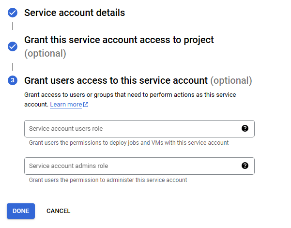

### Initial Setup

[](https://github.com/DataTalksClub/data-engineering-zoomcamp/blob/main/01-docker-terraform/1_terraform_gcp/2_gcp_overview.md#initial-setup)

For this course, we'll use a free version (upto EUR 300 credits).

1. Create an account with your Google email ID
2. Setup your first [project](https://console.cloud.google.com/) if you haven't already
    - 
    - 
    - eg. "CrimesMX", and note down the "Project ID" (we'll use this later when deploying infra with TF)
3. Setup [service account & authentication](https://cloud.google.com/docs/authentication/getting-started) for this project

### Setup for Access


1. [IAM Roles](https://cloud.google.com/storage/docs/access-control/iam-roles) for Service account:
3. Please ensure `GOOGLE_APPLICATION_CREDENTIALS` env-var is set.
    - 
    - Click on "Service Account", then click on "Create Service Account"
    - 
    - 
    - Add these roles in addition to _Viewer_ : **Storage Admin** + **Storage Object Admin** + **BigQuery Admin**
    - 
    - 
    - 
    - 
    - Enable these APIs for your project:
        - [https://console.cloud.google.com/apis/library/iam.googleapis.com](https://console.cloud.google.com/apis/library/iam.googleapis.com)
        - [https://console.cloud.google.com/apis/library/iamcredentials.googleapis.com](https://console.cloud.google.com/apis/library/iamcredentials.googleapis.com)
    - Click on you new service account and click on "Keys" tab.
    - Click on "Add Key"
    - 
    - 
    - 
    - Download service-account-keys (.json) for auth. This key will be used in TF and Mage IA (personal-gcp.json).
4. Download [SDK](https://cloud.google.com/sdk/docs/quickstart) for local setup
5. Set environment variable to point to your downloaded GCP keys:
```sh
export GOOGLE_APPLICATION_CREDENTIALS="<path/to/your/service-account-authkeys>.json"

# Refresh token/session, and verify authentication
gcloud auth application-default login
```

Now you are able to work with terraform. Go to [terraform](https://github.com/kiramishima/crimes_in_mexico_city_analysis/tree/master/terraform) directory to follow the next steps.